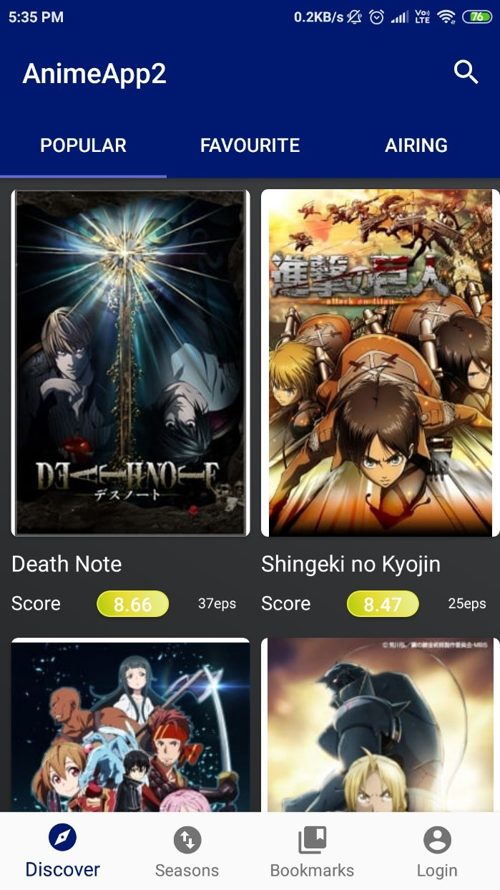
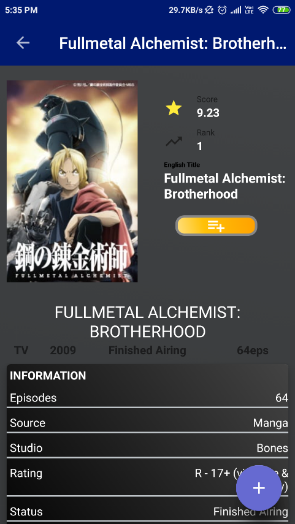
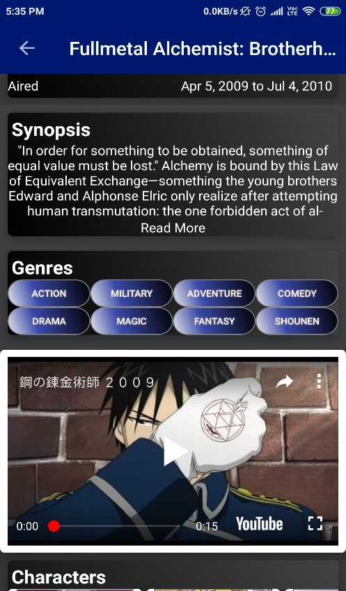
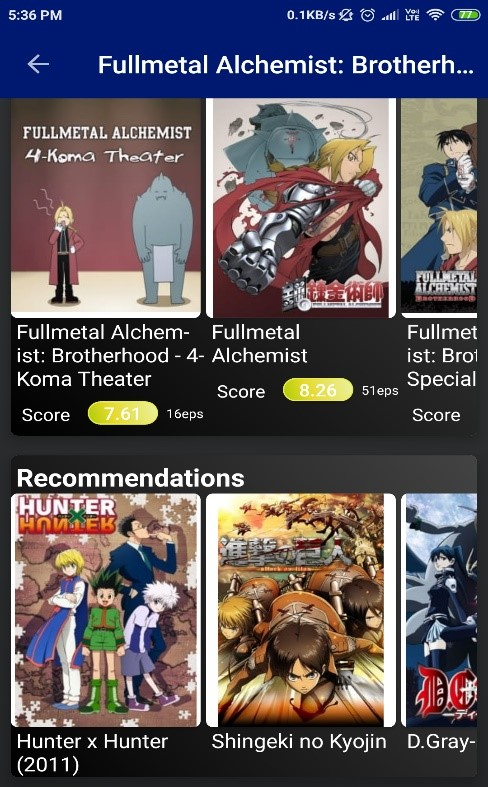
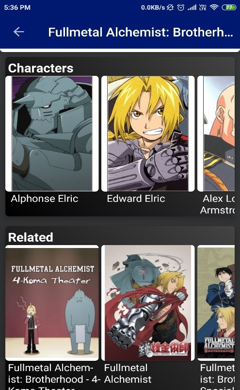
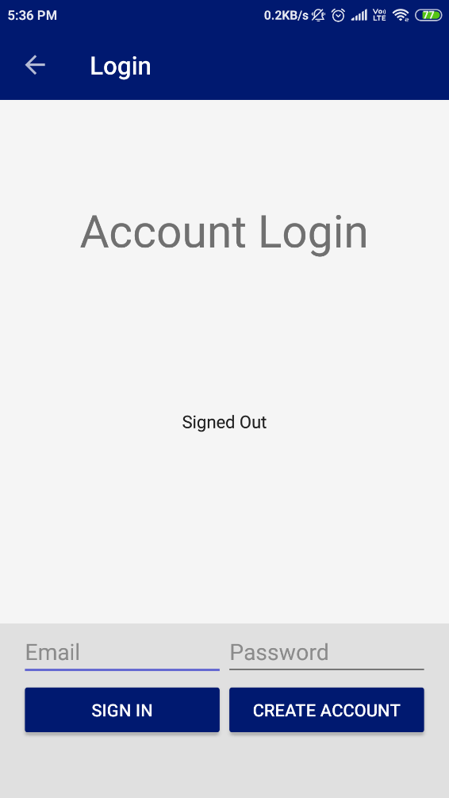
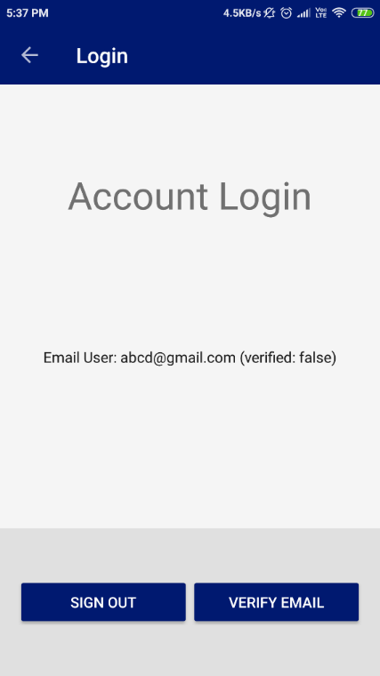
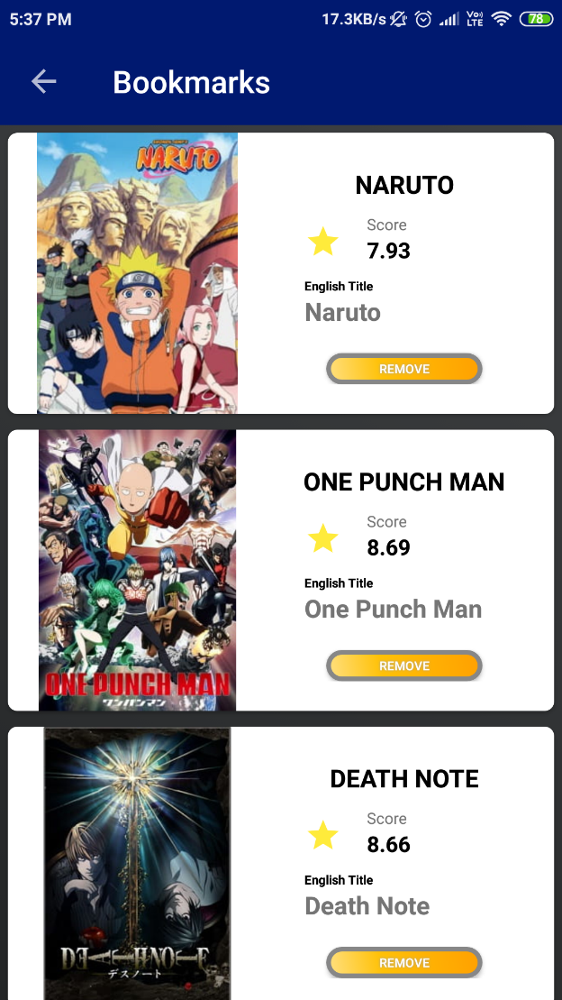
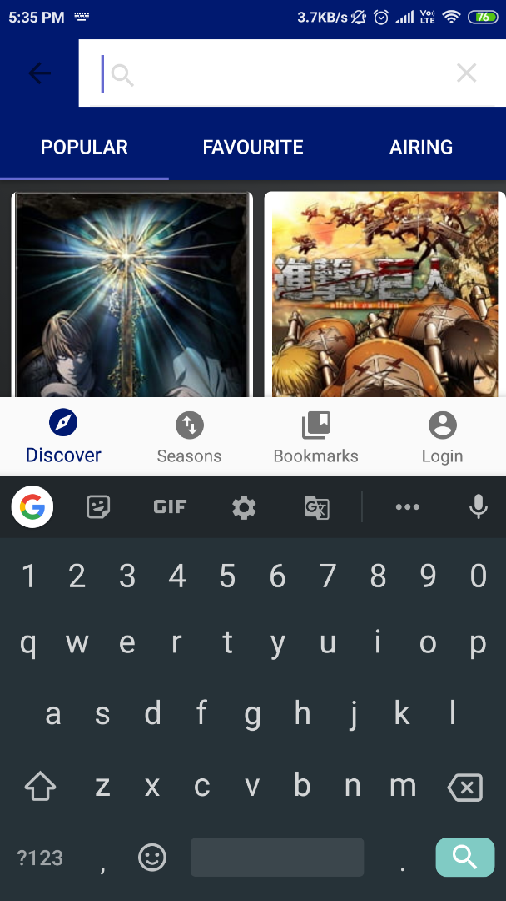

# AnimeDBApp
Project Description
MyAnimeList App
MyAnimeList app is anime  cataloguing android application .It provides users a list like system of various show so they can bookmark their favourite shows. It facilitates users to find similar types of show and provide a large database.
It’s uses MyAnimeList website database which is shown on the app using MyAnimeList API which provides information in JSON then the information is  shown in  the app in a well-defined manner.
For Signup  Google firebase authentication service is used which provides a email and password based account for app and for storing users bookmarked shows details ituses firebaseRealtime database which is a NoSQL database.
There is a search option where you can search and directly go into info page of that show, In show detail page you can bookmark ,see other details like rating of the show, genres, synopsis, related shows and recommendations ,watch trailer within the app ,
In discover sections there are 3 tabs which have categories of Popular ,Trending ,Favourite according to the users rating
 

**Home Screen**

 
Main screen of the app contain bottom navigation bar and on right there is search icon  where you can search different shows ,default selection of navigation  bar is discover section which consist of 3 tab which categorised  shows on basis of popular ,favourite and airing ,the navigation bar also have seasons ,bookmarks ,login section
All shows image ,user rating and no. of episodes is shown

 
Specific Show Screen

The show screen displays the all information related to that anime in details like length, genre , no. of episodes, synopsis ,trailer and its characters and other related shows. 

It contains a button with add symbol which can be used to bookmark the show ,to use the button user must make an account and verify it

Login/Signup Page

Login Screen  had two fields which are required for account creation email and password ,
After creating an account, you must verify email which will sent to the user’s email inbox
If user doesn’t verify his/her email, then user can’t bookmark the show

 
Bookmark Screen& Search Option

In this screen all the user’s bookmark shows will be shown and there is a remove button which can be used to remove the show from the list
On touching the search icon keyboard will be pop up with a space will be displayed to write the text with an animation 
 
